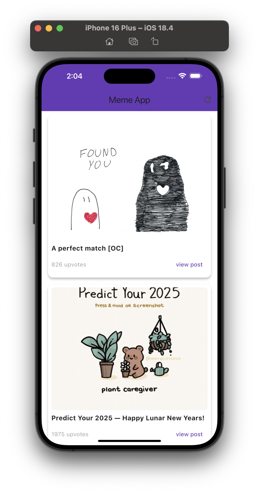
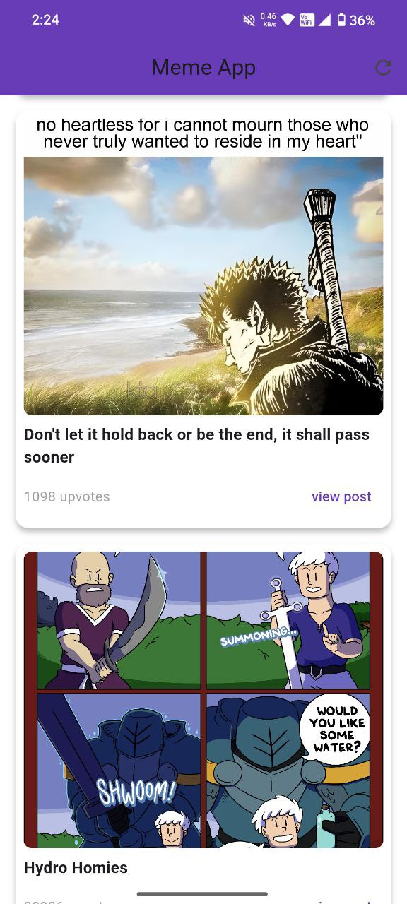
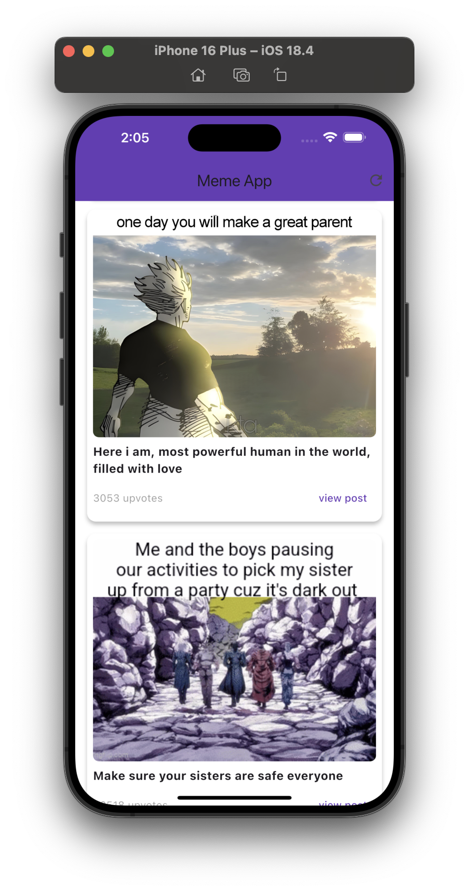

# 🎉 MemeVerse — The Tech Meme App for Techies

<div align="center">


**A beautiful, AI-inspired meme app for techies!**  
_Enjoy a stunning Material 3 UI, smart meme curation, and seamless experience across all platforms. Powered by Firebase for secure Google login and favorites._

[🚀 Live Demo](https://shourya13x.github.io/MemeVerse/) • [📦 Download APK](https://github.com/shourya13x/MemeVerse/releases/latest)

</div>

---

## ✨ Features

- ✨ **Beautiful Material 3 UI** — Modern, smooth, and delightful to use
- 🤖 **AI-inspired Experience** — Smart, fun, and always fresh
- 🔐 **Google Login (Firebase Auth)** — Secure, one-tap sign-in
- ⭐ **Favorites System** — Save memes you love and never lose them
- 🔄 **Infinite Scrolling = Endless Fun & Memes!**
- 📤 **Share Memes with Friends** — Spread the laughter instantly
- 🎨 **Theme Customization** — Light/dark mode & color themes
- 🖼️ **Modern App Icons** — Crisp, borderless icons for all platforms
- ⚡ **Fast & Responsive** — Works on Web, Android, and iOS

> **Pro Tip:** With infinite scrolling, favorites, and easy sharing, MemeVerse is the best way to have fun with your techy friends!

---

## 📱 Screenshots

<div align="center">

| iOS | Android | Web |
|:---:|:-------:|:---:|
|  |  |  |

</div>

---

## 🚀 Quick Start

```bash
git clone https://github.com/shourya13x/MemeVerse.git
cd MemeVerse
flutter pub get
flutter run
```

- **Web:** `flutter build web`
- **Android:** `flutter build apk`
- **iOS:** `flutter build ios`

---

## 🏗️ Tech Stack

- **Flutter 3.7+** & **Dart**
- **Firebase Auth** (Google Sign-In)
- **Reddit API** (OAuth2)
- **Material Design 3**
- **cached_network_image** for fast image loading
- **palette_generator** for dynamic theming

---

## 🖼️ App Icons

All app icons have been updated for a modern, borderless look across Android, iOS, macOS, and Web.  
_If you see the old icon, try clearing your app cache or reinstalling._

---

## 💡 Why MemeVerse?

> "Because memes and tech news belong together — everywhere, for everyone."

---

## 🤝 Contributing

Contributions, issues and feature requests are welcome!  
Feel free to check [issues page](https://github.com/shourya13x/MemeVerse/issues) or submit a pull request.

---

## 📄 License

This project is licensed under the MIT License — see the [LICENSE](LICENSE) file for details.

---

<div align="center">

**Made with ❤️ by Shourya**  
*Connect with me: [LinkedIn](https://www.linkedin.com/in/shouryagupta13/) | [GitHub](https://github.com/shourya13x)*

</div>
